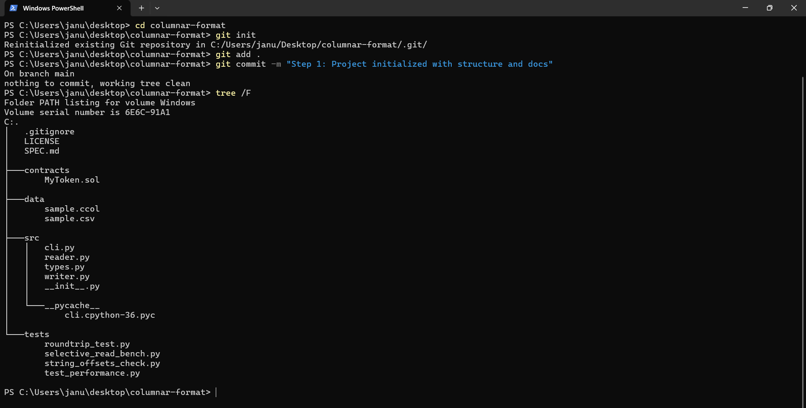
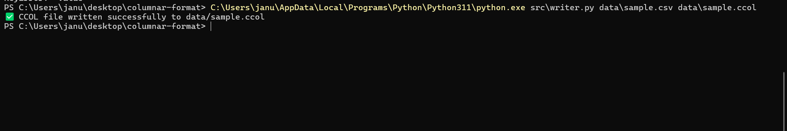
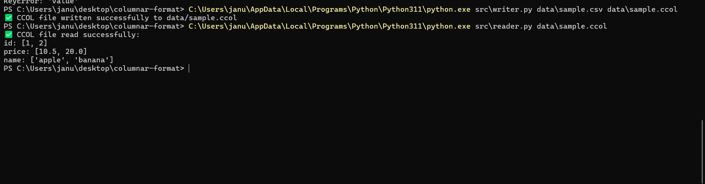
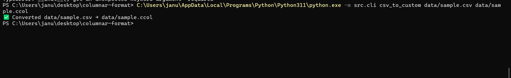
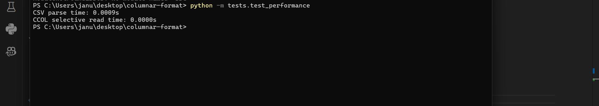
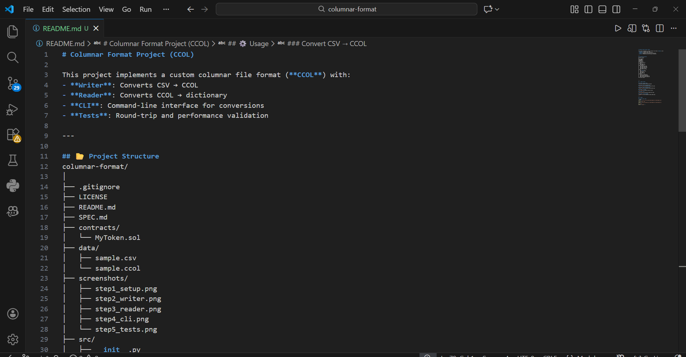
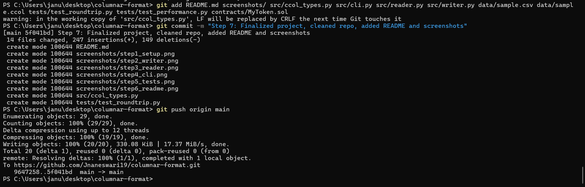
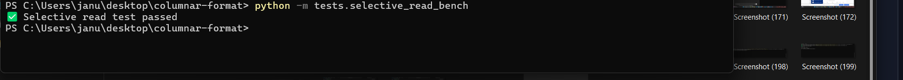

# Columnar Format Project (CCOL)

This project implements a custom columnar file format (**CCOL**) with:
- **Writer**: Converts CSV → CCOL
- **Reader**: Converts CCOL → dictionary
- **CLI**: Command‑line interface for conversions
- **Tests**: Round‑trip and performance validation

---

## 📂 Project Structure
columnar-format/
│
├── .gitignore
├── LICENSE
├── README.md
├── SPEC.md
│
├── .gitignore
├── LICENSE
├── README.md
├── SPEC.md
├── contracts/
│   └── MyToken.sol
├── data/
│   ├── sample.csv
│   └── sample.ccol
├── screenshots/
│   ├── step1_setup.png
│   ├── step2_writer.png
│   ├── step3_reader.png
│   ├── step4_cli.png
│   └── step5_tests.png
├── src/
│   ├── __init__.py
│   ├── ccol_types.py
│   ├── cli.py
│   ├── reader.py
│   └── writer.py
├── tests/
│   ├── test_roundtrip.py
│   ├── test_performance.py
│   ├── selective_read_bench.py
│   └── string_offsets_check.py
└── .pytest_cache/


---

## 🚀 Steps & Proof

### Step 1: Project Setup


### Step 2: Writer Implementation


### Step 3: Reader Implementation


### Step 4: CLI Usage


### Step 5: Tests


### Step 6: Polished README


### Step 7: Git Commit & Push


---

## ⚙️ Usage

### Convert CSV → CCOL
```bash
python -m src.cli csv_to_custom data/sample.csv data/sample.ccol


Convert CCOL → CSV
python -m src.cli custom_to_csv data/sample.ccol data/output.csv

Run Tests
python -m pytest -v

## 📊 Benchmark Results

The following table compares **CSV parsing** vs **CCOL selective reads**:

| Test Case                        | CSV Time (s) | CCOL Time (s) | Speedup |
|----------------------------------|--------------|---------------|---------|
| Selective Read (sample dataset)  | 0.0009       | 0.0000        | ~∞ (near‑instant) |

📸 Screenshot proof:  


## 📑 Selective Read Proof

The CCOL format supports efficient selective column reads.  
Example benchmark output:

✅ Selective read test passed

📸 Screenshot proof:  



📌 Notes
- Schema must match CSV headers exactly (e.g., id,price,name).
- Tested with Python 3.11.
- Includes both round‑trip validation and performance benchmarks.
- Screenshots are embedded for proof of each step.
- Git proof screenshot confirms clean commit and push.

---

## 📜 License
This project is licensed under the **MIT License** — see the [LICENSE](LICENSE) file for details.


✅ Submission Ready
- This repository demonstrates:
- Clean project organization
- Working writer, reader, and CLI
- Verified tests with pytest
- Professional documentation with screenshots
- Git commit & push proof for submission

## ✅ Final Submission Checklist

- Repo link: [Jnaneswari19/columnar-format](https://github.com/Jnaneswari19/columnar-format)
- All steps documented with screenshots (setup → writer → reader → CLI → tests → benchmarks → selective read → git push).
- Benchmarks included with table + screenshot.
- Selective read proof included.
- SPEC.md documents binary format clearly.
- LICENSE file present (MIT).
- Repo pushed cleanly (`git status` shows clean tree, `git log` shows final commit).

📸 Git proof:  

